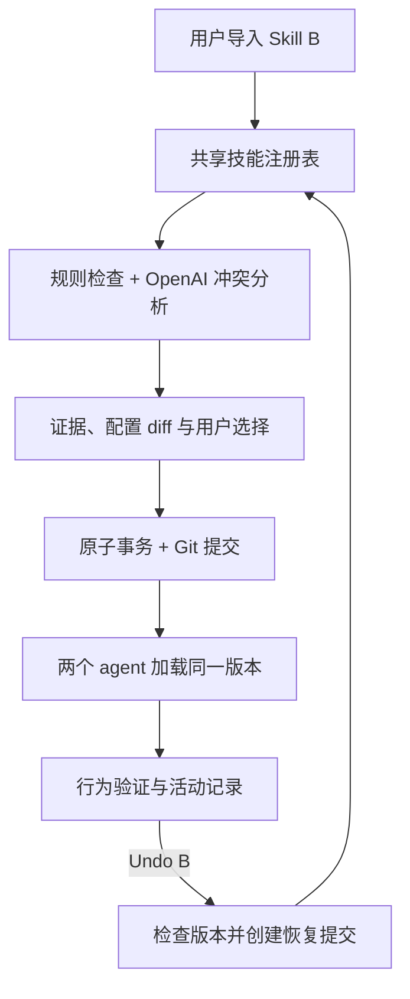

# Skill Manager：可检测冲突、可撤销的 Agent 技能管理系统

## 一句话

**Git for agent skills:** 一个 agent 系统统一管理仓库中的 `SKILL.md`，让多个 agent 读取相同的生效配置；安装前检测技能之间的冲突，记录每次配置变更，并允许用户撤销一次安装及其冲突处理决定。

## 项目定位与目标

这是一个**开发者工具**。它解决团队使用多个 agent 时的三个实际问题：技能散落在不同目录、两个技能可能给出互相矛盾的指令、安装后的配置改动难以准确撤回。

目标是在 **30 小时**内完成一个可运行的闭环：

> 导入技能 B → 发现它与已有技能 A 冲突 → 展示证据和可选解决方式 → 用户确认安装并让 B 生效 → 两个 agent 读取同一配置 → 用户 Undo → B 被移除，A 恢复生效。

最容易记住的展示点是：**“Watch a skill conflict change how agents behave. Now undo the install and watch the original behavior return.”**

## 30 小时 MVP 边界

- **输入：**一个 Git 仓库，包含 `skills/<name>/SKILL.md` 与 `agents.yaml`。后一文件记录 agent 名称、可用技能和优先级或启用状态。
- **支持的操作：**导入一个技能，启用或暂停冲突技能，查看全局生效配置，撤销一次完整事务。
- **冲突检测：**先确定两个技能是否作用于相同任务或文件范围；再用 OpenAI 找出相互排斥的具体指令，并返回各自的原文位置、冲突场景、置信度和解释。确定性规则负责发现同名技能、缺失依赖、重复路径等结构问题。
- **确认与执行：**显示配置 diff；用户选择“保留 A”、“让 B 生效并暂停 A”或“取消安装”。系统不会仅凭模型判断自动覆盖已有技能。
- **共享：**两个演示 agent 从同一版本的技能清单加载配置，并显示各自看到的版本号。已有会话通过显式 reload 更新；演示不假设任意平台会自动热更新技能。
- **撤销：**一次安装连同暂停 A 的变更视为**同一个事务**。Undo 创建新的恢复提交，恢复 A 的启用状态，并移除 B 的安装与分配；保留历史记录。
- **不做：**任意 agent 平台适配、自动修改冲突技能的正文、无条件回滚并发产生的新改动、通用技能市场。

## 技能来源与导入方式

| 来源 | 用途 | 导入时注意 |
| --- | --- | --- |
| [Anthropic Skills](https://github.com/anthropics/skills) | 现成的 `SKILL.md` 范例和基础模板；适合选取真实技能验证解析器。 | 检查具体技能目录的许可；部分文档技能仅开放源码供参考。 |
| [OpenAI Plugins](https://github.com/openai/plugins) | 当前的 Codex 插件示例；可研究插件内 `skills/` 的真实组织方式。 | 插件不一定只有技能，第一版只导入明确选中的技能目录及所需资源。旧的 `openai/skills` 仓库已提示转向这里。 |
| [skills.sh](https://skills.sh/) | 浏览社区技能，发现不同写法和潜在冲突案例。 | 以它链接的原始 GitHub 仓库为导入来源，记录具体 commit，不把目录页面当成技能文件。 |
| [Agent Skills specification](https://agentskills.io/specification) | 验证 `SKILL.md` 格式及元数据要求。 | 它是格式规范，不是要安装的技能集合。 |

**导入单位是完整技能目录，不能只复制 `SKILL.md`。**一个技能可能引用 `scripts/`、`references/`、模板或其他资源；安装预览应显示这些文件的整体 diff。每次导入记录 `source_url`、`source_commit`、目录路径、文件内容哈希及许可信息，使安装和 Undo 都指向确定的版本。

**演示数据集：**主冲突使用团队自己编写的 A（`pnpm`）和 B（`npm`），确保行为可观察且结果可重复；另从上述仓库选择少量真实技能，展示解析和无冲突导入。真实技能用于证明系统适用于外部目录，主冲突无需依赖外部项目恰好出现相反指令。

## 演示中的具体冲突

准备两个 `SKILL.md`：

| 技能 | 同一仓库任务中的指令 |
| --- | --- |
| A：Package Manager Policy | “When adding a JavaScript dependency, use `pnpm add` and keep `pnpm-lock.yaml` updated.” |
| B：NPM Workflow | “When adding a JavaScript dependency, use `npm install` and update `package-lock.json`.” |

两者对**同一个任务**给出互斥的包管理流程。页面展示原文与对应文件位置，而不只展示模糊的“可能冲突”。用户决定让 B 生效，系统在安装 B 的同一事务中暂停 A，并记录原因。

演示 agent 接到“为这个示例仓库添加一个依赖”的任务，显示其选择的命令和锁文件。随后点击 **Undo install B**，重新加载相同 agent 的配置并重跑该任务，观察它恢复选择 A 的流程。可以同时打开第二个 agent，证明两个实例读取相同的已提交配置版本。

为保证演示可重复，命令在隔离的示例仓库中执行或以 dry run 展示；测试基于可观察的工具调用和配置版本，而非仅凭 agent 自述。

## 架构

| 模块 | 实现要点 |
| --- | --- |
| Skill registry | 扫描 `SKILL.md`，保存名称、路径、版本、作用范围及启用状态；向 agent 提供同一份已提交清单。 |
| Conflict analyzer | 用规则筛选候选对；OpenAI 生成结构化冲突报告，引用两边的原文与适用条件；用户决定如何处理。 |
| Transaction manager | 在临时工作树准备改动，展示 diff；确认后一次提交技能文件与 `agents.yaml`，记录事务 ID 和前后 commit。 |
| Undo engine | 检查当前文件版本是否仍匹配事务的预期后态；匹配则创建反向提交。不匹配则展示三方 diff，要求用户处理冲突。 |
| Agent adapter | 演示用 agent 通过 registry 获取技能文本及配置版本；两次运行留下可比较的工具调用记录。 |
| Dashboard / CLI | 展示技能图、冲突证据、变更历史、agent 所见版本、安装和 Undo。界面只需支撑一条清晰演示路径。 |

**“像 Git” 的准确含义：**每次变更有 diff、commit 和可追踪的历史；撤销用新的反向提交保留审计记录。如果后续有人修改了 B 或关联配置，系统不直接抹去新改动。

## Sponsor prize 对应

| 优先级 | 赛道 | 为什么匹配 | 真正需要做出的证据 |
| --- | --- | --- | --- |
| **主攻** | **Warp — Best Developer Tool** | 这直接改善 agent 技能的安装、配置、调试与版本管理；该赛道的奖项说明没有 Warp API 使用门槛。 | 现场完成安装冲突检测、行为验证和撤销，并展示开发者节省的排查步骤。 |
| **主攻** | **OpenAI — API Prizes** | OpenAI API 用于有引文和适用范围的语义冲突分析；Codex 协助实现和测试一个具体功能。 | 展示结构化冲突证据、解决选择、真实 agent 行为；说明 Codex 帮助修复的一个具体问题。 |
| **有条件冲刺** | **Cloudflare — Best Agent with a Brain** | 若 Worker 承担注册表、冲突分析调度、事务编排与 agent 配置读取，D1/DO 保存生效版本和历史，则符合其 backend brain 定位。 | Worker 必须是核心运行层；只把 dashboard 放在 Pages 不符合该奖项的要求。此方案应在本地闭环跑通后再决定。 |
| **独立扩展** | **Huawei — openJiuwen Multi-Agent** | 可让 Conflict Analyst、Change Planner 和 Verifier 协作：分析冲突、规划事务、独立检查安装和 Undo。 | 必须真正基于 JiuwenSwarm 或 WorkSwarm，实现角色协作、反馈和端到端演示。仅有两个普通 agent 使用共享技能并不自动符合该赛道。 |

**不建议强行叠加：**Browserbase 不在核心工作流中；Composio 只有在确实通过它连接外部应用执行有意义的操作时才值得加入。奖项数量不是核心目标，完整且可验证的产品体验更重要。

## 30 小时路线

| 时段 | 交付 |
| --- | --- |
| 0–4 小时 | 定义 repo 结构、技能元数据、`agents.yaml`、示例 A/B；选取少量真实技能并记录来源、commit 和许可。 |
| 4–10 小时 | 完成技能扫描、配置读取、两个 agent 的相同版本加载和可观察的命令选择。 |
| 10–16 小时 | 完成候选筛选、OpenAI 冲突报告和原文引用；加入结构化校验与无冲突对照案例。 |
| 16–22 小时 | 完成预览 diff、用户确认、原子提交、Undo 版本检查与恢复提交。 |
| 22–26 小时 | 完成界面与 90 秒演示路径：安装 B、两 agent 生效、撤销、行为恢复。 |
| 26–30 小时 | 连续跑通演示、修复失败路径、写安装/运行/演示说明并录制备用视频。 |

若时间不足，保住**一个冲突、一个安装事务、一个 agent 行为验证和一次完整 Undo**。第二个 agent 的可见性展示与云端后端可稍后补齐。

## 90 秒 demo 脚本

1. **开场：**“我们的两个 agent 共用技能库，但新装的技能可能与旧技能给出相反指令。”展示当前 A 生效。
2. **导入 B：**系统高亮 `pnpm` 与 `npm` 的具体冲突行；用户选择“安装 B，并暂停 A”。
3. **执行：**展示一次 Git 提交和两个 agent 加载的新配置版本；同一任务选择 B 的流程。
4. **Undo：**点击 Undo B，系统生成恢复提交；两个 agent reload 后重新选择 A 的流程，历史仍可查看。
5. **收尾：**“Teams can try new agent skills, understand their conflicts, and safely return to a known working configuration.”

## 完成标准

- 安装前能指出一对真实冲突的**具体原文与共同适用场景**；无冲突案例不会误报为阻断。
- 用户选择 B 后，B 的安装与 A 的暂停落在同一可追踪事务中。
- 两个 agent 读取同一个配置版本；演示中至少一个 agent 的实际工具选择随配置变化。
- Undo 生成新的恢复提交，恢复 A，并能在后续改动冲突时停止自动撤销、显示原因。
- 项目仓库包含安装和演示步骤；提交材料清楚区分已完成的主奖项实现与可选扩展。

## 待确认的产品选择

本版按 **SKILL.md 仓库**、**冲突与撤销是主演示**、**30 小时** 来规划。下个版本需要确定：第一版 agent 是自建演示 agent 还是现成平台的 adapter；团队实际人数；以及是否愿意把 Cloudflare 或 Huawei 作为实现约束，而不只是报名目标。
